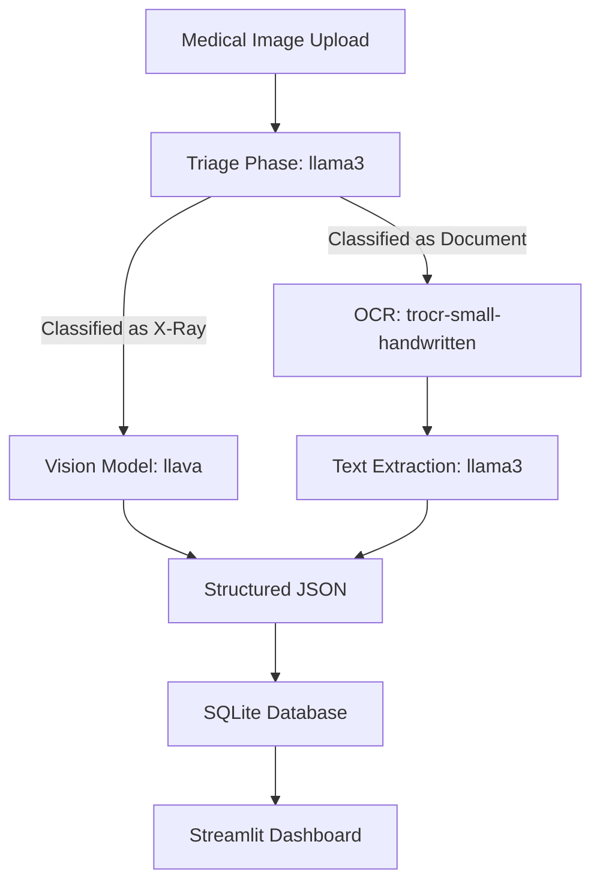

# Architecture

## Workflow

## Components

### Frontend
- Streamlit

### AI Layer
- **Triage**: `llama3` (Local)
- **OCR**: `microsoft/trocr-small-handwritten` (Local)
- **Document Text LLM**: `llama3` (Local)
- **X-Ray Vision LLM**: `llava` (Local)

### Storage
- SQLite

### Output
- Strict JSON Formats
- Searchable Medical Database